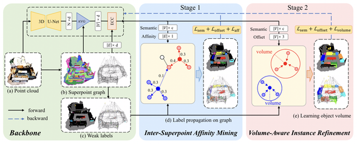
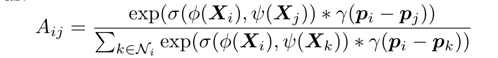
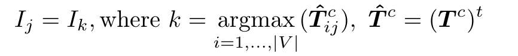
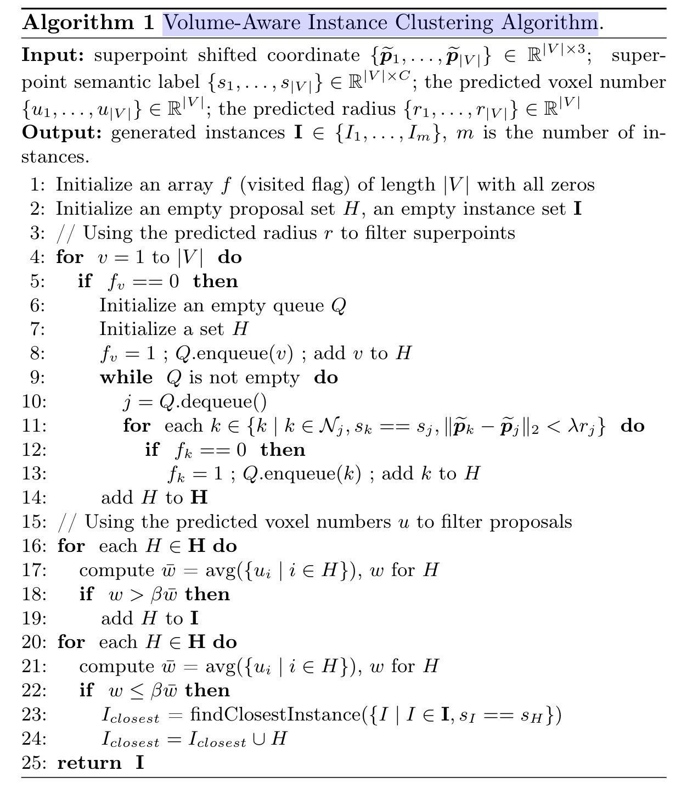
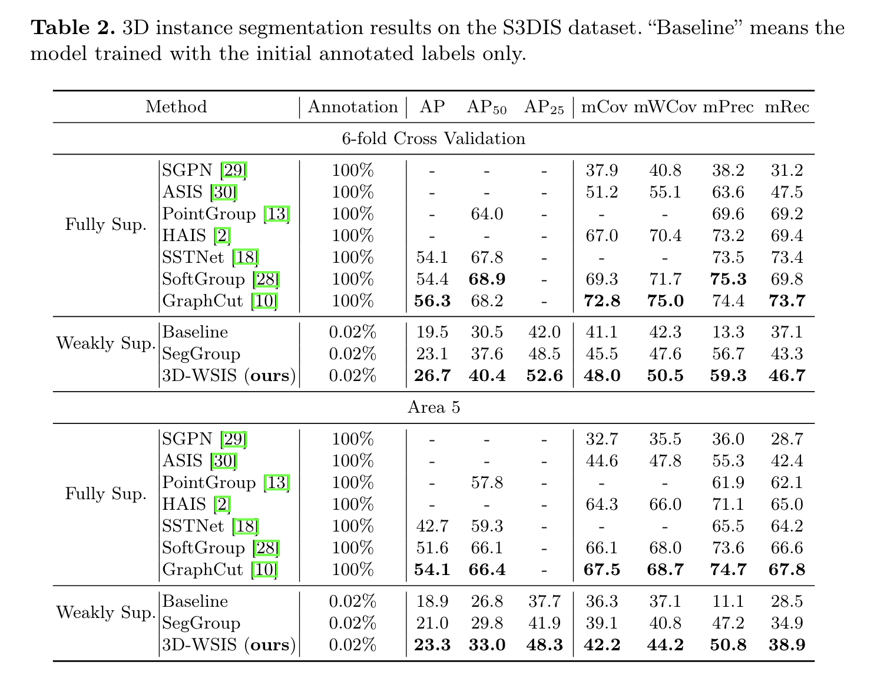

# 摘要

由于三维点云的标注标签很少，如何学习点云的区别特征来分割姿态中的对象是一个具有挑战性的问题。在本文中，我们提出了一个简单有效的**3D实例分割框架**，该框架可以通过为每个实例只注释一个点来实现良好的性能。

具体来说，为了处理极少数的标签，例如分割，我们首先以无监督的方式将点云过度分割为超点，然后将点级别注释扩展到超点级别。然后，基于超点图，我们提出了一个考虑语义和空间关系的超点间亲和力挖掘模块，以自适应地学习超点间的亲和力，从而通过语义感知随机游动生成高质量的伪标签。最后，我们提出了一个体积感知的实例细化模块，通过在超点图上应用对象的体积约束来分割高质量的实例。

在ScanNet-v2和S3DIS数据集上的大量实验表明，我们的方法在弱监督点云实例分割任务中达到了最先进的性能，甚至优于一些完全监督的方法。

# 介绍

在本文中，我们提出了一个简单而有效的弱监督3D站姿分割框架，该框架可以通过每个实例一个点注释来获得令人印象深刻的结果。对于具有少量注释标签的弱监督点云实例分割，我们的直觉在于两个方面：（1）在罕见注释下，有效的标签传播对于生成高质量伪标签至关重要，尤其是在3D实例分割中。（2） 弱监督三维实例分割比弱监督三维语义分割更具挑战性，因此我们考虑引入对象体积约束来改进实例分割结果。

具体来说，我们首先使用无监督方法[15]将点云过度分割为超点并构建超点图。这样，可以将点标高标签扩展到叠加点标高标签。然后，我们提出了一个超点间亲和力挖掘模块，用于基于几个带注释的超点级别标签生成高质量的伪标签。基于超点图，我们利用相邻超点的语义和空间信息自适应地学习超点间的亲和力，该亲和力可用于通过语义感知的随机游动沿超点图传播超点标签。最后，我们提出了一个卷感知的实例定义模块来提高实例分割性能。基于使用超点级传播的训练模型，我们可以通过超点聚类获得粗略的实例分割结果，并进一步从实例分割结果中推断出对象体积信息。对象体积信息包含体素数和对象半径。推断出的物体体积信息被视为相应实例的地面真实性，以重新训练网络。

在测试阶段，基于对象体积信息，我们利用预测的对象体积信息引入了一种体积感知的实例聚类算法，用于分割高质量的实例。在ScanNet-v2[6]和S3DIS[1]数据集上的大量实验证明了我们方法的有效性。

# 方法

我们的方法的总体架构如图1所示。骨干网络（第3.1节）首先将点云和超点图作为输入，并预测超点语义标签和偏移向量。然后，超点间亲和力挖掘模块（第3.2节）通过语义感知随机游走在超点图上传播标签。最后，体积感知实例重新细化模块（第3.3节）学习对象体积信息，以提高实例分割性能。

## 基础网络

**超点图**：我们采用无监督的点云过分割方法来生成超点并构造超点图。$G=(V,E)$，V表示通过聚集具有相似几何特征的点而生成的重叠点，E表示通过链接k个最近的重叠点而构建的相邻重叠点之间的先验连接关系。

根据参考文献15、18生成超点图

**超点特征提取**：具体来说，首先使用点云上的3D U-Net[8]提取点特征，然后通过平均池将点特征聚合到叠加点特征中。之后，基于超点图，我们使用边缘条件卷积（ECC）[24]来提取超点特征。最后，使用超点特征来预测超点的语义。

## 超点间亲和力挖掘

通过使用学习的超点间亲和力，我们设计了一种简单的语义感知随机游走算法，用于超点图上的标签传播。

**超点亲和力学习**：基于超点图，我们学习两个相邻超点之间的关系，以表征它们的亲和力。期望两个相邻超点之间的学习亲和力可以引导标签沿着超点图的边缘传播。基础网络嵌入为$X\in R^{|V|\times d}$，$|V|$是超点的数量，$d$是特征尺寸。给出第$i$个超点的潜入$X_i$和他的第一个顺序的邻居$\cal N_i$我们利用超点的语义和空间信息来自适应地学习超点间的亲和力。第$i$个超点与其第$j$个相邻点之间的亲和力$A_{ij}$表示为

$p_i$和$p_j$是叠加点的质心坐标，$\psi(.)$和$\phi(.)$是线性投影，$\gamma(.)$是多层感知器，$\sigma(.,.)$是两点的相似性生成。语义相似性通过点生成来衡量，而空间相似性通过减法来衡量。

因此，亲和力$A_{ij}$考虑了叠加点的语义和空间信息。之后，我们使用学习的超点间亲和力来更新超点嵌入。对于第$i$个超点，新的超点嵌入$\tilde X_i = A_{ij} * \rho(X_j) + X_i$，$\rho(.)$是线性投影，

**通过语义感知随机游走进行标签传播**：对于第$c$个分类，语义特征矩阵为$S^c$。如果第$i$个和第$j$个超点的语义类相同则$S^c_{ij}=1$否则为0。语义矩阵$S^c$，超点亲和力矩阵$A$，相邻矩阵$M$。计算权重矩阵$P^c=M\odot S^c\odot A$。过度概率矩阵$T^c=D^{-1}P^c,D_{ii}=\sum_jP^c_{ij}$。第$j$个超点的伪实例标签传播

$T_{ij}^c$表示将第i个超点的实例标签传播到第j个超点上的概率，这是迭代次数。

## 卷积感知实例优化

我们提出了卷感知实例细化模块，通过使用对象卷信息来分割实例。我们首先介绍如何通过伪实例预测对象体积。然后，我们提出了体积感知实例聚类算法，以在超点图上生成实例。

**通过伪实例进行对象体积预测**：我们在第一阶段使用预训练模型，通过将叠加点投票到最近的注释点来生成伪实例。具体来说，通过添加预测偏移矢量。对于对应的超点中心，我们可以将每个超点中心移到更靠近对应对象中心的位置。为了生成实例，移位的超点被赋予与具有相同语义的最近注释点相同的实例标签。这里我们将生成的实例视为伪实例。根据生成的伪实例，我们计算其体积信息。我们考虑实例内的体素数量和实例半径来测量实例的体积。实例半径定义为实例中心与最远点之间的距离。因此，对于每个伪实例，我们可以在第一阶段之后获得其卷信息。

**卷感知实例集群**：在第一阶段预测了对象的体积后，我们还将预测的体积在第二部分用作对网络进行再训练的。因此，在第二阶段，我们可以额外预测每个叠加点的实例体积信息（体素数量和半径）。算法具体步骤如下。

## 网络训练

我们的方法是一个两阶段的框架。第一阶段学习超点间亲和力以通过随机游走传播标签，而第二阶段利用对象体积信息来细化实例。这一部分主要介绍了训练的Loss函数介绍。

**第一阶段**

**第二阶段**

# 实验部分

俩数据集ScanNet-v2和S3DIS

# 结论

在本文中，我们提出了一种简单而有效的方法，用于极少数标签的弱监督三维实例分割。为了利用很少的点级符号，我们在点云上使用无监督点云过分割方法来生成超点并构建超点图。基于构建的超点图，我们开发了一个超点间亲和力挖掘模块，用于通过随机游走自适应学习标签传播的超点间的亲和力。我们进一步开发了一个体积感知实例细化模型，通过学习对象体积信息来指导超点图上的超点聚类。在ScanNet-v2和S3DIS数据集上的实验表明，我们的方法在弱监督的3D实例分割方面达到了最先进的性能。