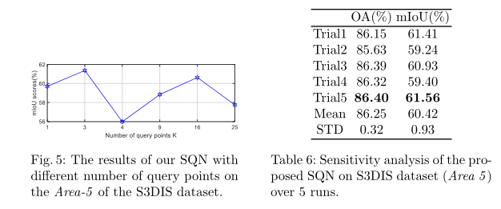

# SQN：大规模三维点云的弱监督语义分割

## 摘要

**动机**：完全标记点云费时费力；数十亿点的大型点云越来越普遍；有证明了在完全注释假设下设计的现有基线即使面对1%的随机点注释也只会轻微降级；但是面对0.1%注释的时候分割精度很低；

**想法**：点云是三维世界的样本，点在局部邻域的分布是相对均匀的，表现出很强的语义相似性，提出了一种新的弱监督方法来隐式增强高度稀疏的监督信号。

**结论**：所提出的语义查询网络(SQN)在弱监管方案下对7个大型开放数据集取得了良好的性能，而只需要0.1%的随机注释点进行训练，大大降低了注释的成本和工作量。

## 介绍

首先说了一些三维点云中经典的完全监督的网络，比如**pointnet**和**SparseConv**。

其次指出3D语义分割的五类做法：使用二维图像标签进行训练；使用少量的3D标签具有梯度逼近、监督传播、扰动一致性；使用过度分割的叠加注释；对比预训练，然后用较少的3D标签进行微调。

但是仍然存在问题。现有的方法通常用自定义方法注释不同数量的数据进行训练，没有普适性；现有的方法通常会自我预训练、数据扩充和后处理，与端到端的训练方法相比更难调优调参更难部署；没有充分考虑到大规模点云中点近邻的强局部语义同质性，或者没有有效地考虑到这一点，导致有限但有价值的注释没有得到充分利用。

SQN首先通过现有的特征提取器将整个原始点云编码为一组分层潜在表示，然后将任意一个3D点位置作为输入，在局部邻域内查询潜在表示的子集。这些查询的表示被总结为一个紧凑的向量，然后输入一系列多层感知器(MLPs)来预测最终的语义标签。

**本文贡献**：我们提出了一种新的弱监督方法，利用点邻域查询充分利用稀疏训练信号。我们观察到现有的完全监督方法退化缓慢，直到1%的稀疏点注释，这表明完整、密集的标签是多余的，不是必要的。我们的基准比基准有了显著的改进，大大超过了最先进的弱监管方法。

## 相关工作

**全监督学习**：虽然这些方法在已有的数据集上取得了显著的效果，但它们依赖于大量的标记数据进行训练，这在实际应用中代价高昂且难以实现。相比之下，本文的目标是从一小部分注释中学习语义，这在实践中成本更低，也更现实。

**无监督学习**：虽然这些方法取得了很好的效果，但都局限于简单的对象，无法处理复杂的大尺度点云。

**弱监督学习**：分为有限间接注释（只有sub-cloud level或seg-level标签可用。）、有限点注释（给定一小部分具有精确语义标签的点用于训练）和与1T1C作比较（1T1C存在对地面标签完全依赖和错误计算标签占比两个问题）。

## 探索弱监督

**弱标注策略：**标注方法有**随机标注稀疏点标签**、主动标注稀疏点标签或按区域标注、标注分段级标签或超级点标签、标注子云标签

**标注工具：**基于CloudCompare开发，随机采样10%，1%，0.1%并进行适当放大，使用标准标签模式

**标注成本：**需要2分钟标注S3DIS数据集中标准房间1%的点，需要20分钟标准同一个房间的所有点。

**实验设置：**S3DIS数据集，区域12346作为测试，区域5完全注释。所有训练区域中的每个房间随机挑选10%/1%/0.1%/0.01%3D点进行注释训练。

**使用全监督方法作为baseline：**使用pointnet、pointnet++和RandLANet作为baseline。在弱注释数据上进行端到端的训练，不使用额外模块，只使用标记的点来计算损失进行反向传播。共训练12个模型。

显然的，随着标注的点百分比越来越少表现越来越差。低于0.1%时显著下降。

对于通常由主要类主导并具有大量可重复的局部模式的大规模点云的分割，开发在注释成本和估计精度之间具有良好权衡的弱监督方法是可取的。基于这一动机，我们提出了SQN，它仅使用0.1%的标签进行训练，就能达到接近完全监督的准确性。

## SQN

### 概览

SQN由两个不同的部分组成：学习不同视觉模式的点局部特征提取器；一个灵活的点特征查询网络，为了尽可能搜集相关语义特征。

### 点局部特征提取器

该部件用于为所有点提取局部特征，在本文中，使用RandLA-Net编码器作为特征提取器。SQN并不局限于任何特定backbone网络，（特征器提取器的编码器是可以替换的，按他的意思）

编码器包括四层局部特征聚合和随机抽样操作。与**RandLA-Net**网络相同（待看）。给定有$N$个点的输入点云$\cal P$，每次编码层编码后提取4个等级的分层点特征。$\frac{N}{4}\times32$，$\frac{N}{16}\times128$，$\frac{N}{64}\times256$，$\frac{N}{256}\times 512$。为了方便后续的查询网络，每个分层特征向量都保留了相应的点位置。

### 点特征查询网络

给定提取的点特征，该查询网络被设计为收集尽可能多的相关特征，并使用可用的稀疏信号进行训练。如图3的底部所示，它将特定的3D查询点作为输入，然后获取一组与该点相关的已学习点特征。这是假设查询点与收集到的点特征共享相似的语义信息，这样来自查询点的训练信号可以与相关点共享和反向传播。

该网络包括：空间邻近点特征搜索；插值查询点特征；查询点语义推断。

**空间邻近点特征搜索**：给出一个3D点$p$的坐标，这个模块根据欧几里得距离，在前四层编码特征中搜索最近的$K$个点，例如对于提取的第一级别电特征，选择最相关的$K$个点，获得原始特征$\{F^1_p,F^2_p,...,F^K_p\}$

**插值查询点特征**：对于每一级特征，查询的$K$个向量被压缩为查询点$p$的一个紧凑表示。根据$p$和$K$点之间的欧氏距离，应用三线性插值法（待看）来计算$p$的特征向量。将四个层次的特征向量连接在一起，表示整个3D点云中的所有相关点特征。

**推断查询点语义**：得到查询点$p$的唯一特征向量后，输入到一系列的MLP中，推断出点的语义类别。

总的来说，给定一个稀疏的注释点，我们并行查询它们的相邻点特征进行训练。这使得有价值的训练信号可以反向传播到更广阔的空间环境中。在测试过程中，将所有三维点输入两个子网络进行语义估计。事实上，我们的简单查询机制允许网络从一个明显更大的接受域推断点语义类别。

### 实现细节

将语义查询的超参数$K$经验设为3，遵循RandLA-Net中使用的数据集预处理，用0.1%的随机注释点进行端到端的训练。

## 实验

### 和SOTA比

在S3DIS、ScanNet和Semantic3D评估性能。使用OA和mIoU作为主要评价指标。

**S3DIS：**0.1%比RandLA-Net搞出9%，能与完全监督的RandLA-Net媲美。

**ScanNet：**mIoU高于子云标签训练的MPRM

**Semantic3D：**在0.1%训练的SQN在Semantic8和Reduced8子集上都获得了完全监督基线的竞争性性能。

### 大尺度三维基准

现有的弱监督没有这一项，只与完全监督的方法比。本模型0.1%训练的，在SensatUrban数据及上超过了完全监督的RandLA-Net。

### 消融实验

为了评估我们框架中每个模块的有效性，我们进行了以下消融研究。所有消融的网络都在带有0.1%标签的Areas{1/2/3/4/6}上进行训练，并在S3DIS数据集的Area-5上进行测试。

**语义查询变体**：就是针对分层点特征查询机制进行评估，针对不同的特征层进行选择查询。

**临近点超参数改变：**显然的，相邻区域越大越好，但是过大会包含语义不同的点。选择3的时候是相对最优的。

**不同注释点：**随机做了多次，结果差不多，说明实验具有鲁棒性。且性能变化存在于们、沙发等较小的类别中。

**注释点比例变化：**0.01%以下很难work，10%mIoU超过了完全监督（门、窗、柱提升了2%~5%）作者认为某种意义上10%的标签是够用的，或者可以用来解决类别分布不平衡的问题。

**扩展到按区域标注的数据：**首先通过无监督过分割方法将点云分组为区域，然后通过各种主动学习策略手动标注稀疏数量的区域。在相同的10次迭代内，超过了SPVCNN和MinkowskiNet。这一结果进一步验证了我们的SQN在弱监管下的有效性和优越性。

## 结论

提出了一种简单的SQN框架来学习大规模点云的语义，只需要0.1%的标签进行训练。通过大量的实验指出了密集三维标注的冗余性，然后基于三维空间中相邻点的语义相似性假设，提出了一种有效的语义查询框架。提出的SQN简单地遵循了更广泛的标签传播的概念，但显示出对大规模点云弱监督语义分割的巨大潜力。将这种方法扩展到弱监督实例分割、泛视分割和基于主动学习的交互式注释。