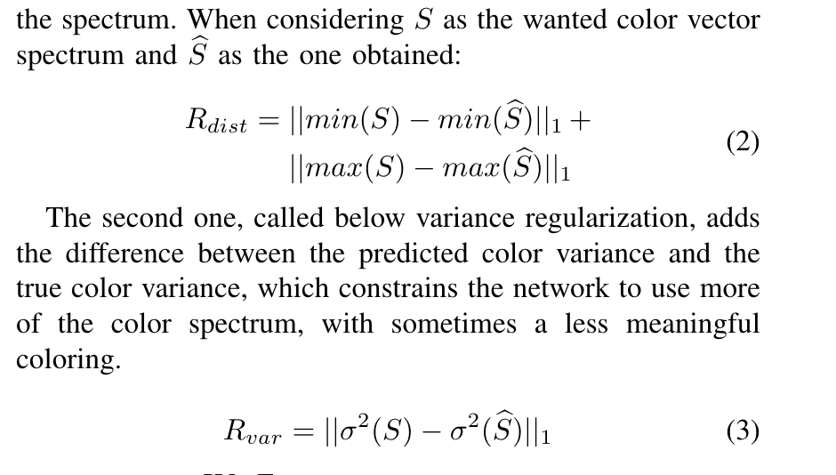

# 减少用于三维点云语义分割的合成数据增强中的域偏移

## 摘要

在点云的语义分割中使用深度学习能够大幅提高分割精度。然而，可用的数据集仅限于少数应用，对其他领域的适用性有限。使用合成数据和真实数据可以减轻创建专用数据集的负担，代价是在训练过程中最容易解决的域偏移，而直接在数据上处理问题的探索较少。为此，提出了两种缓解域偏移的方法，一是通过增强合成数据的生成和采样，二是通过利用未标记点云的颜色信息对合成的未着色数据进行着色。获得的结果证实了它们在改进语义分割结果方面的有用性（对于在S3DIS区域1上训练的网络，将+3.43转换为mIoU）。更重要的是，设计着色方法显示了基于点的网络将颜色信息与递归几何特征链接的能力。最后，即使在训练过程中包含原始合成数据阻碍学习的情况下，所提出的方法也能够弥合域偏移差距

## 介绍

- 提出了使用合成3D模型进行数据增强，并提出了一种快速场景创建协议
- 研究了三维点采样方案的影响
- 提出了一种新的着色方法，该方法允许展开着色的、未标记的数据

## 相关工作

### 合成数据增强

### 点云着色

## 方法

介绍了一种由三个步骤组成的合成数据生成方法：生成由三维网格组成的场景（第III-A节），在点云中变换场景（第III-B节），然后对获得的场景着色（第III-C节）

### 合成数据生成

每个布局采用一种随机生成方法：墙壁、地板、天花板、门、窗，有时还有各种各样的物体，如墙壁上的灯或装饰。这些布局中心的空间是空的，以允许添加内容。一旦布局及其边界已知，就使用物理引擎将对象填充场景。

### 采样

将生成的数据采样为3D点云。

### 着色

除了第一层外，编码器网络的每个后续层都为ResNet，在不可变形的KPConv内核周围都有一个链路和ReLU。链接用于在编码器和解码器之间传播点。解码器中特征的传播是通过KNN插值和PointNet++中定义的多层感知器（MLP）进行的。最后，使用由MLP和Sigmoid组成的最后一层。

将颜色生成问题视为回归问题，使用均方误差（MSE）作为损失函数。如果考虑点$P$，其实际颜色$c$和预测颜色$cp$，损失函数为$loss=\frac{\sum_{i=1}^P||cp_i-c_i||^2}{P}$。该损失函数可用于任何格式的点云数据，并且确保了位置和颜色。特定和重复的空间配置将获得独特的颜色，因为MSE强烈地惩罚了较大的差异。而不明显的空间配置将获得中性颜色，这是MSEthat所青睐的，可以减少小错误。同时，这种容差也可能导致颜色通道中的小扰动，从而降低过度拟合的风险。

两种正则化策略。第一种，被称为距离正则化，是惩罚缺乏使用最亮和最暗的颜色；它将色谱集中在中心附近，并对其余的光谱进行边际利用。第二种被称为下方差正则化，它将预测的颜色方差与真实颜色方差之间的差异相加，这限制了网络使用更多的颜色光谱，有时会使用意义较小的颜色

## 实验结果

## 结论

在这项工作中，提出了通过直接对数据进行操作来减少合成数据增强域偏移问题的不同方法。这些方法与在训练的分段网络上操作的方法兼容并互补。此外，即使在仅合成数据不能改善分割性能的情况下，所提出的方法也允许改进分割。

关于采样和着色方法，将研究它们对其他应用领域的适用性。第一个结果带来了信心，即这两种方法可以轻松转换，并且仍然能够改进分割结果。然而，虚拟激光定位可能需要修改和使用应用领域的专家知识。所提出的定位方法仅在具有简单几何结构的室内场景中进行了测试，其效率需要在更具挑战性的环境中进行评估

最后，GAN着色可以产生真实的结果，可以在语义分割改进方面与所提出的着色方法进行比较

## 感想

总的来讲，是一种数据加强生成网络。将点云数据经过着色网络训练，将原本的点云数据进行重点重新生成，并针对新生成的点云数据作分割处理。新生成的点云数据的分割效果，比原分割效果好上一些。但好的不多，如果仅用于语义分割来讲，总体差别不大，除非分割网络对颜色信息有影响。

